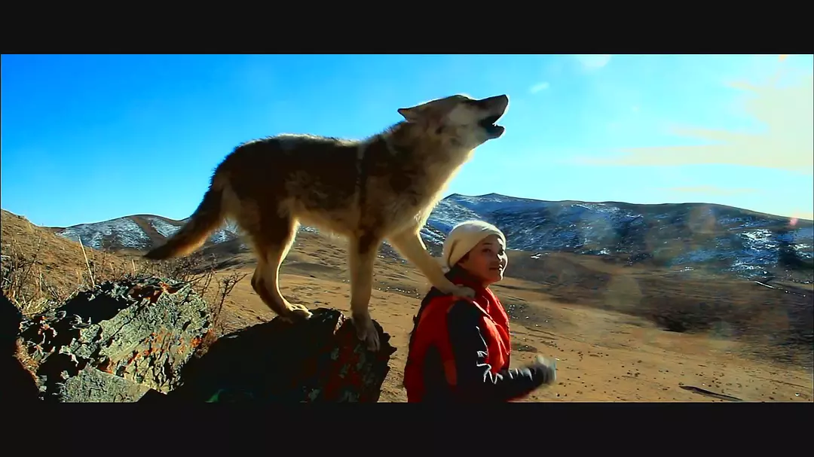

上次看了《七十七天》后，就一直想找一些川藏题材的电影看一下，于是就找到了《重返狼群》。

说《重返狼群》是一部电影，但更像是一部纪录片，导演用真实的镜头，描写了人类与狼超越种族的爱，深深的震撼了我。

印象最深的是这句话：

> “还有什么比活着更重要的吗？”
> “自由。”

当你救了一条小狼之后，你会选择让它去动物园安然度过一生，还是让它回到大自然，面临未知的饥饿和凶险？

作者做了在我看来最好的选择：她苦苦训练它，在它拥有在大自然中生存的能力后，放它回去，给它自由！

敬佩作者！

 
[豆瓣评分](https://movie.douban.com/subject/26920269/)

[知乎评价](https://www.zhihu.com/question/61158537)
