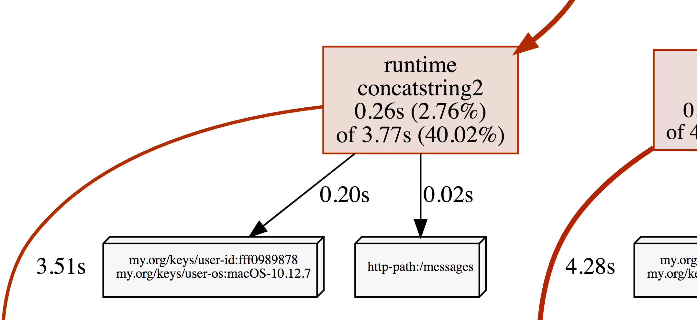

 >最近在看golang监控这块儿东西，就找到了OpenCensus，Google开源的东东，用这个来作为golang监控的出口应该很不错，学习下先。
 
 [OpenCensus](http://opencensus.io/) 是 Google 开源的一个用来收集和追踪应用程序指标中立厂商的第三方库，能够减少应用的部署与构建成本，尤其适合微服务架构。

OpenCensus 有各种不同的编程语言编写的版本，包括 Go、Java、PHP、C++、Python 等等。它旨在帮助开发者更容易收集和提交跟踪应用程序指标。这是一个中立的单一库发行，可自动收集和跟踪应用指标，可在本地显示，也可将其发送到分析工具。

[OpenCensus-Go](https://github.com/census-instrumentation/opencensus-go)是golang的实现版本，支持glang1.8或者更新的版本。

## 安装

```
$ go get -u go.opencensus.io/...
```


## 数据导出

OpenCensus可以将数据导出到各种后端。
目前OpenCensus支持:

* [Prometheus](https://prometheus.io/) 统计
* [OpenZipkin](https://zipkin.io/) 追踪
* [Stackdriver](www.stackdriver.com)

## Tags

Tags可以理解为用来传递数据的键值对。它们可以在同一个进程中使用context.Context进行传递，也可以通过编码解码的方式在网络上传输。

### 新建一个key

使用tag.NewKey来新建一个key。

``` golang
key, err := tag.NewKey("my.org/keys/user-os")
if err != nil {
	log.Fatal(err)
}
```

使用该key的人需要知道这个key的name和类型，类型目前只支持string，其他类型将在以后支持。

### 创建与键key关联的tagMap

使用tag.NewMap来创建一个tagMap。

``` golang
osKey, err := tag.NewKey("my.org/keys/user-os")
if err != nil {
	log.Fatal(err)
}
userIDKey, err := tag.NewKey("my.org/keys/user-id")
if err != nil {
	log.Fatal(err)
}

tagMap, err := tag.NewMap(ctx,
	tag.Insert(osKey, "macOS-10.12.5"),
	tag.Upsert(userIDKey, "cde36753ed"),
)
if err != nil {
	log.Fatal(err)
}
```
### 通过context传递tagMap

context在golang中是一种很好的传递信息的模块，在OpenCensus中可以通过下面这种方式来传递数据：

```
m := tag.FromContext(ctx)
```

或者

```
ctx, err = tag.New(ctx,
	tag.Insert(osKey, "macOS-10.12.5"),
	tag.Upsert(userIDKey, "fff0989878"),
)
if err != nil {
	log.Fatal(err)
}
```

## Stats统计

### 创建，检索和删除measure

创建和加载measure：

```
videoSize, err := stats.Int64("my.org/video_size", "processed video size", "MB")
if err != nil {
	log.Fatal(err)
}
```

按名称检索measure：

```
m := stats.FindMeasure("my.org/video_size")
if m == nil {
	log.Fatalln("measure not found")
}

```

## Traces追踪

### 开启一个span

```
ctx, span := trace.StartSpan(ctx, "your choice of name")
defer span.End()
```

### Profiles

OpenCensus Tags可以作为Profiler标签，该功能适用于Go 1.9及更高版本。

```
ctx, err = tag.New(ctx,
	tag.Insert(osKey, "macOS-10.12.5"),
	tag.Insert(userIDKey, "fff0989878"),
)
if err != nil {
	log.Fatal(err)
}
tag.Do(ctx, func(ctx context.Context) {
	// Do work.
	// When profiling is on, samples will be
	// recorded with the key/values from the tag map.
})
```

 CPU profile 截图：
 
 

