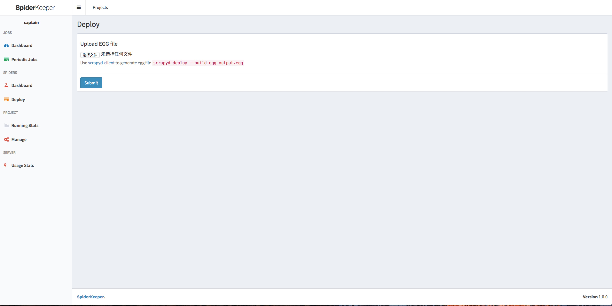

最近公司爬虫的需求越来越多，所以打算用一套更专业的爬虫框架， 来实现一个爬虫系统，于是就想到了市面上比较流行的框架scrapy。

选择scrapy原因如下：

- 流行了很久，Github两万多的star
- 直接支持并发、存储、监控
- 功能强大，快速上手


相比较其他的解决方案，功能强大、快速上手是我选择scrapy一个很重要的原因。

直接支持并发、存储和监控虽说已经足够强大，但是离我设想的爬虫系统还缺少两个重要的因素，定时任务和UI界面。后来找到了scrapyd和spiderkeeper，帮我解决了这两个问题。于是乎，这个爬虫系统就构建完成了，我们无需再造轮子构建一套爬虫系统，只需把重点放在抓取数据的本身即可。

## scrapyd

scrapyd 是由scrapy 官方提供的爬虫管理工具，使用它我们可以非常方便地上传、控制爬虫并且查看运行日志。

### 安装


```
pip install scrapyd
```

### 使用

在scrapy项目下执行：

```
scrapyd
```

scrapyd提供了一套简单的api接口，和一套简单的web页面。

创建爬虫任务：

```
curl http://localhost:6800/schedule.json -d project=myproject -d spider=spider2
```


查看爬虫任务：

在网页中输入：[http://localhost:6800/](http://localhost:6800/)


## spiderkeeper

主要实现 scrapy 工程的部署，抓取任务状态监控，定时启动爬虫等功能。支持多个 scrapyd 服务 ，方便爬虫集群的管理。


### 安装

```
pip install spiderkeeper
```

### 使用

先启动scrapyd，然后启动spiderkeeper：

```
scrapyd

spiderkeeper --server=http://localhost:6800
```

然后spiderkeeper默认会在5000端口开放：

```
SpiderKeeper startd on 0.0.0.0:5000 username:admin/password:admin with scrapyd servers:http://localhost:6800
```

打开`http://localhost:5000`


看到效果图：

